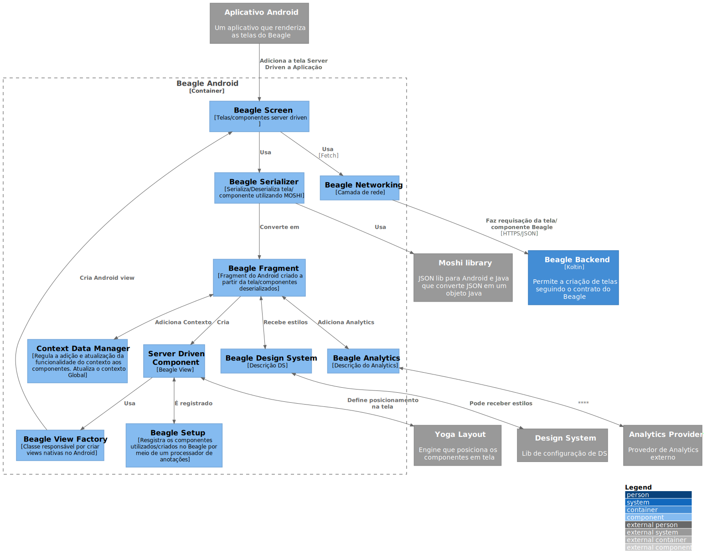

# Beagle Android

`\C3 -  Component\Beagle Android`

* [C4Model](/docs/README.md)
  * [C1 -  Context](/docs/C1%20-%20%20Context/README.md)
  * [C2 - Container](/docs/C2%20-%20Container/README.md)
  * [C3 -  Component](/docs/C3%20-%20%20Component/README.md)
    * [**Beagle Android**](/docs/C3%20-%20%20Component/Beagle%20Android/README.md)
    * [Beagle Backend](/docs/C3%20-%20%20Component/Beagle%20Backend/README.md)
    * [Beagle Web](/docs/C3%20-%20%20Component/Beagle%20Web/README.md)

---

[C3 -  Component (up)](/docs/C3%20-%20%20Component/README.md)

---

O Beagle Android estabelece a relação entre o Framework Beagle e aplicativos Android. 
É ele quem orquestra a criação de views no ambiente Android a partir dos componentes recebidos do Backend.
Os componentes do Beagle são:
* Componentes visuais default e customizados (botões, textos, campos de textos, etc)
* Ações default e customizadas (Navegação, Alerta, SendRequest, etc)
* Operações default e customizadas (Operadores aritiméticos, Operadores lógicos, etc)

O Diagrama abaixo mostra o "caminho" que um componente "percorre" dentro de um aplicativo Android que utiliza o Beagle.

O Beagle possuiu um mecanismo de **processamento de anotações** que cria inicialmente o arquivo de configuração do framework chamado BeagleSetup. Esse arquivo é gerado automaticamente quando o projeto é montado (build) pela primeira vez e nele são registrados os componentes criados no Android, como ações, operações, componentes visuais (botões, textos, etc), camada de rede, dentre outros. Todos esses componentes são anotados para que o processador possa mapea-los, como por exemplo, o ´@RegisterAction´ é utilizado para registrar ações, ´@RegisterOperation´ para operações e o ´@RegisterWidget´ para componentes visuais.

