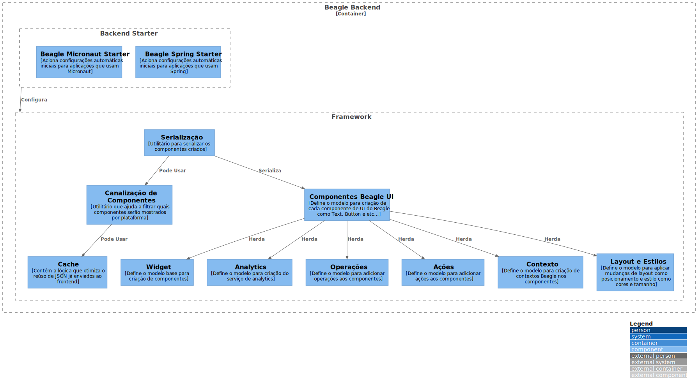

# Beagle Backend

O Beagle Backend é uma biblioteca de suporte que ajuda na criação de telas Beagle a partir de um servidor.
- O Backend Starter configura automaticamente a biblioteca em aplicações usando Spring ou Micronaut. 
- O Framework fornece todos os contratos que serão usados na criação dos componentes.
- O Framework também possui um utilitário de serialização que transforma toda tela criada no JSON que será enviado para um frontend.

