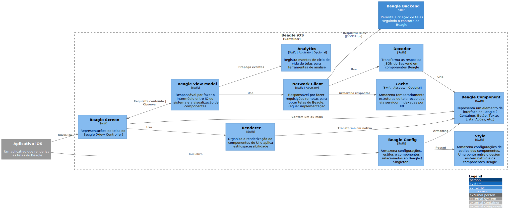

# Beagle iOS

`\C3 -  Component\Beagle iOS`

* [C4Model](/docs/README.md)
  * [C1 -  Context](/docs/C1%20-%20%20Context/README.md)
  * [C2 - Container](/docs/C2%20-%20Container/README.md)
  * [C3 -  Component](/docs/C3%20-%20%20Component/README.md)
    * [Beagle Android](/docs/C3%20-%20%20Component/Beagle%20Android/README.md)
    * [Beagle Backend](/docs/C3%20-%20%20Component/Beagle%20Backend/README.md)
    * [**Beagle iOS**](/docs/C3%20-%20%20Component/Beagle%20iOS/README.md)
    * [Beagle Web](/docs/C3%20-%20%20Component/Beagle%20Web/README.md)

---

[C3 -  Component (up)](/docs/C3%20-%20%20Component/README.md)

---

O Beagle iOS é uma biblioteca que tem como finalidade integrar o sistema Beagle em um projeto existente de aplicativo nativo dos sistemas Apple iOS.

As peças chave para entendimento da arquitetura e sua aplicação são os componentes abaixo:

* **Beagle Config:** Classe de instância única que armazena todas as configurações, customizações e implementações do Beagle (propriedade `Dependencies`). Sua inicialização é essencial para o funcionamento do projeto e ocorre no `AppDelegate` do aplicativo hospedeiro.
* **Beagle View Controller e Beagle View:** São as portas de entrada para as telas server-driven do Beagle. O **Beagle View Controller** pode ser adicionado na pilha de navegação diretamente a partir da classe `AppDelegate` e age como uma tela independente. Já **Beagle View** é uma UIView do UIKit, ela possibilita adicionar uma tela Beagle como subview de uma tela existente, sendo assim, torna-se dependente de um view controller ou UIView previamente definidos. O conteúdo de um **Beagle View Controller** é uma composição de **Server Driven Components** traduzidos para UIKit.
* **Server Driven Component:** Representação de qualquer elemento de interface do Beagle. Ele pode representar tanto elementos visuais como botões, textos e listas quanto ações de navegação, comportamentos de clique e operações.
* **Network Client:** Por padrão o Beagle iOS não provê uma estratégia padrão para realização de requisições remotas, dando a liberdade aos desenvolvedores implementarem a abordagem mais compatível com o contexto do projeto, como: direcionamento de entpoints, regras de segurança e tratamento de erros. **Network Client** fica responsável por comunicar-se com os recursos implementados no **Beagle Backend**.
* **Recursos de apoio:** O Beagle iOS provê certo nível de customização de alguns componentes de projeto. Ao observar o diagrama abaixo, é possível notar alguns componentes com a descrição "abstrato | opcional", tais componentes são meios de propagar eventos para ferramentas de analytics contratadas ou regras customizadas de armazenamento local das telas.

