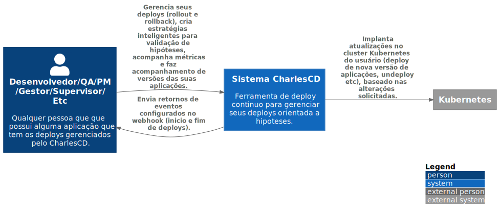

# C1 -  Context

`/C1 -  Context`

* [C4Model](/docs/README.md)
  * [**C1 -  Context**](/docs/C1%20-%20%20Context/README.md)
  * [C2 - Container](/docs/C2%20-%20Container/README.md)
  * [C3 -  Component](/docs/C3%20-%20%20Component/README.md)
    * [Module 1](/docs/C3%20-%20%20Component/Module%201/README.md)

---

[C4Model (up)](/docs/README.md)

---

É o primeiro nível do nosso desenho. A ideia é mostrar as interações de forma macro, sem muitos detalhes, dando enfoque às comunicações e dependências entre sistemas e usuários que compõem e interagem com o software.

