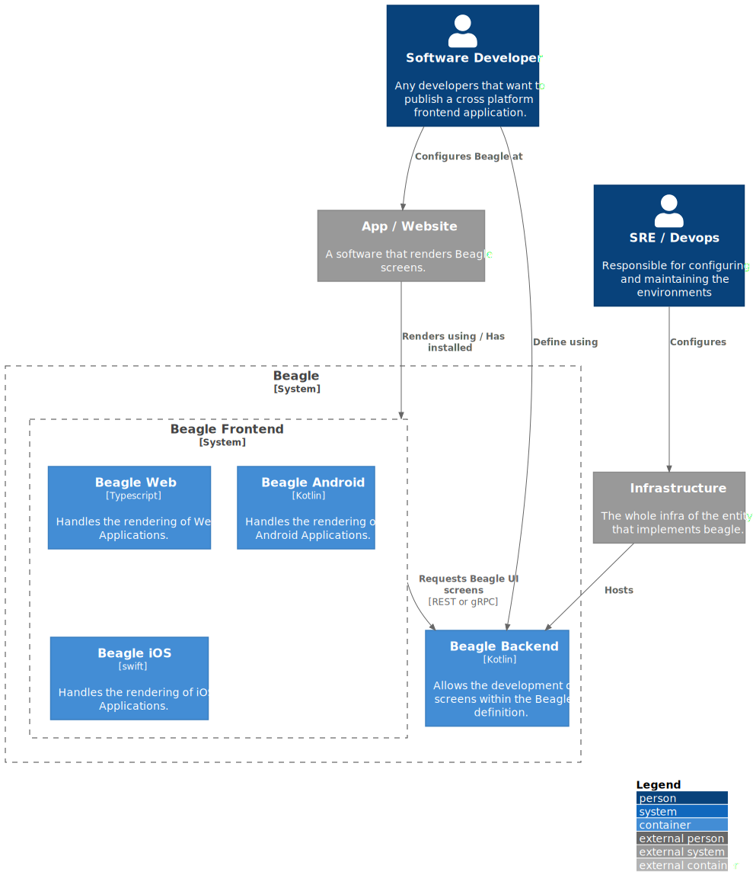

# C2 - Container

`\C2 - Container`

* [C4Model](/docs/README.md)
  * [C1 -  Context](/docs/C1%20-%20%20Context/README.md)
  * [**C2 - Container**](/docs/C2%20-%20Container/README.md)
  * [C3 -  Component](/docs/C3%20-%20%20Component/README.md)
    * [Beagle Android](/docs/C3%20-%20%20Component/Beagle%20Android/README.md)
    * [Beagle Backend](/docs/C3%20-%20%20Component/Beagle%20Backend/README.md)
    * [Beagle iOS](/docs/C3%20-%20%20Component/Beagle%20iOS/README.md)
    * [Beagle Web](/docs/C3%20-%20%20Component/Beagle%20Web/README.md)

---

[C4Model (up)](/docs/README.md)

---

**Level 2: System Diagram**

At this level it is shown in a more detailed way the whole system environment, its containers (do not confuse with Docker) and how they interact with each other. Here the highlights go to the architecture and technologies. In short the ideia is to paint a picture of the system in a broader form. A container could be an application, a database, a file system, etc.

***Beagle Containers**

The second level of detailing brings us to the **containers**. And beagle has two of them `backend` and `frontend`

* The Beagle Frontend is installed in Web or Mobile applications which natively render the received screens from beagle backend
* The Beagle Backend is configured in backend applications to easy the development of server driven components

