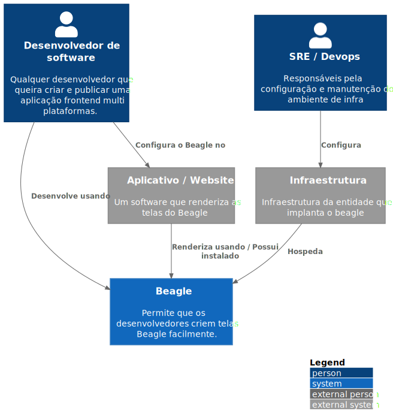

# C1 -  Context

`\C1 -  Context`

* [C4Model](/docs/README.md)
  * [**C1 -  Context**](/docs/C1%20-%20%20Context/README.md)
  * [C2 - Container](/docs/C2%20-%20Container/README.md)
  * [C3 -  Component](/docs/C3%20-%20%20Component/README.md)
    * [Module 1](/docs/C3%20-%20%20Component/Module%201/README.md)

---

[C4Model (up)](/docs/README.md)

---

**Level 1: Diagrama de contexto do sistema**

Esse level mostra de forma macro a aplicação como um todo, os atores, seus papéis e também como eles interagem entre si. O principal objetivo aqui é abstrair ao máximo a solução e não entrar em detalhes exagerados.

***Contexto Beagle***

O Beagle é um framework open source que ajuda desenvolvedores a implementar aplicações Server-Driver de uma maneira multi plataforma.

Desenvolvedores podem facilmente criar e prototipar telas frontend usando a biblioteca Beagle Backend e seus utilitários para layout (posicionamento e aparência) e comportamento (ações).

Uma vez criadas, essas telas podem ser enviadas para aplicações frontend mobile ou web, elas usam a biblioteca do Beagle Frontend para renderizar os layouts.

